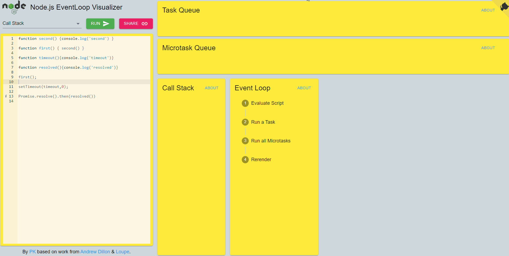

# Node.js EventLoop Visualizer

Added feature to support Node.js native API such as `setImmediate` & `process.nextTick`

Try it out! [Node-Event-Loop](https://node-event-loop.herokuapp.com/)

The repo for the backend service is [here](https://github.com/Darkripper214/Node-EventLoop-Visualizer-Server).

Improvement based on work from [Hopding](https://github.com/Hopding/). & [Loupe](http://latentflip.com/loupe/).